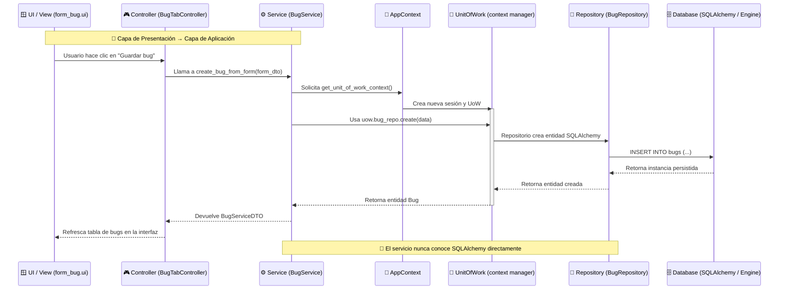

# 🔄 Flujo Horizontal — UAT Tool

Este diagrama muestra el **recorrido de una operación típica**  
(por ejemplo: “crear bug”, “editar requirement”, “cargar lista de bugs”),  
desde la capa de presentación hasta la base de datos.

---

## 🧭 Diagrama de Flujo de Ejecución (Horizontal)

