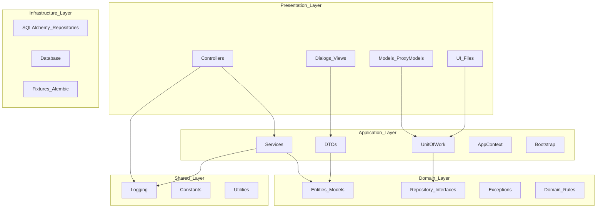

# 🧩 UAT Tool — Arquitectura y Dependencias

Este documento describe la arquitectura actual del proyecto **UAT Tool**, sus capas principales, dependencias verticales y convenciones de diseño.

---

## 📘 Visión General

La aplicación sigue una arquitectura **en capas (Layered Architecture)**, con separación estricta entre:

- **Presentation Layer (presentación/UI)**
- **Application Layer (servicios, DTOs, contextos, UoW)**
- **Domain Layer (entidades, repositorios abstractos, reglas de negocio)**
- **Infrastructure Layer (implementaciones concretas, DB, ORM)**
- **Shared Layer (utilidades comunes)**

---

# 🧩 UAT Tool — Arquitectura y Dependencias

Este documento describe la arquitectura actual del proyecto **UAT Tool**, sus capas principales, dependencias verticales y convenciones de diseño.

---

## 📘 Visión General

La aplicación sigue una arquitectura **en capas (Layered Architecture)**, con separación estricta entre:

- **Presentation Layer (presentación/UI)**
- **Application Layer (servicios, DTOs, contextos, UoW)**
- **Domain Layer (entidades, repositorios abstractos, reglas de negocio)**
- **Infrastructure Layer (implementaciones concretas, DB, ORM)**
- **Shared Layer (utilidades comunes)**

---

## 🧭 Diagrama de Dependencias Verticales (Mermaid)

